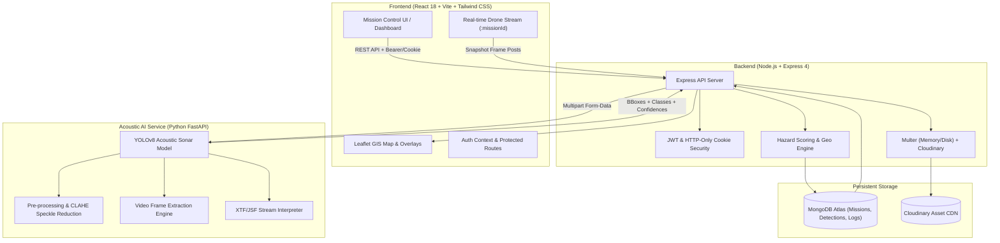

<div align="center">

# 🌊 OceanSentinel AI — Marine Debris & Sonar Intelligence Platform

**AI-Powered Side-Scan Sonar Analysis for Marine Debris Detection**


-0284c7?style=for-the-badge)


Professional MERN-stack application for government and marine research agencies to automatically analyze Side-Scan Sonar (SSS) imagery, video streams, and sonar logs, detecting ghost nets, pipes, cylinders, shipwrecks, and unknown artificial anomalies using a **YOLOv8-based detection service**.

[Key Features](#-key-features) • [System Architecture](#-system-architecture) • [Multi-Modal Ingestion](#-multi-modal-ingestion-pipeline) • [AI & Hazard Scoring](#-ai-detection--hazard-scoring-engine) • [API Reference](#-api-endpoints-reference) • [Quick Start](#-quick-start--installation) • [Deployment](#-environment-variables--deployment)

</div>

---

## 🌊 Overview & Problem Statement

Ghost fishing gear, discarded industrial pipelines, chemical cylinders, and artificial maritime wreckage represent a severe and escalating ecological threat to oceanic biodiversity, navigation channels, and coral reef ecosystems.

### Critical Challenges in Conventional Marine Monitoring
- **Exhaustive Manual Inspection:** Hydrographic surveyors spend **8+ hours per survey mission** reviewing thousands of megabytes of acoustic waterfall imagery.
- **Acoustic Mimicry & Speckle Noise:** Natural seabed structures (geological ridges, sandwaves, boulders) produce echo profiles that mimic man-made debris, leading to human fatigue and high error rates.
- **Format Heterogeneity:** Side-scan sonar data arrives as raw digital logs (`.xtf`, `.jsf`), video waterfalls, or hydrographic mosaic stills with fragmented geolocation metadata.
- **Latency in Response:** Without real-time processing or immediate hazard indexing, critical navigational hazards and coral-entangling ghost nets go unaddressed for weeks.

**OceanSentinel AI** resolves this bottleneck by integrating a trained YOLOv8 acoustic detection model with full-lifecycle mission governance, geospatial mapping, automated hazard scoring, and multi-modal file ingestion.

---

## 🔄 Workflow

```
Side-Scan Sonar Input (Image / Video / Log / Live Stream)
        ↓ Upload (JPG/PNG/TIFF/ZIP, MP4/MOV/AVI/MKV/WEBM, XTF/JSF/SDF)
        ↓ Preprocessing (CLAHE contrast normalization, speckle reduction)
        ↓ YOLOv8 Object Detection (FastAPI inference service)
        ↓ Confidence Filtering (low-confidence & natural features discarded)
        ↓ Hazard Scoring (0–100)
        ↓ Metadata Parsing + Geotagging
        ↓ Interactive Map Visualization
        ↓ JSON/CSV Report Generation
```

---

## ⚡ Key Features

### 🎯 Multi-Modal Sonar Ingestion
- **Side-Scan Sonar Imagery:** High-resolution batch upload (`.jpg`, `.png`, `.tiff`, `.zip`) with automated speckle filtering and contrast enhancement.
- **Continuous Sonar Video Streams:** Direct upload of ROV/AUV video feeds (`.mp4`, `.mov`, `.avi`, `.mkv`, `.webm`) sampled at dynamic frame intervals.
- **Hydrographic Sonar Logs:** Native acoustic log processing supporting eXtended Triton Format (`.xtf`), Edgetech (`.jsf`), and `.sdf`.
- **Real-Time Drone / Webcam Ingestion:** Live browser-based optical/sonar stream prediction with adjustable capture cadence (1–10s) and dynamic detection overlays.

### 🧠 Intelligent Acoustic Object Detection & Filtering
- **Trained Marine Object Classes:** Ghost Nets, Underwater Pipes, Metallic Cylinders, Shipwrecks, Aircraft Debris, and Unknown Anthropogenic Debris.
- **Natural Feature Discrimination:** Automated filtering of benign seabed morphology (natural ridges, sand ripples, rocks) to minimize false alarms.
- **YOLOv8 Inference Service:** A dedicated Python FastAPI microservice (`https://oceansentinal.onrender.com`) runs the sonar-tuned YOLOv8 model, with automated fallback handling if the service is unreachable.

### ⚠️ Dynamic Hazard & Risk Assessment
- **Multi-Factor Scoring Matrix (0–100):** Real-time hazard indexing based on object classification, detection confidence, geometric scale (bounding box area), depth tier, and proximity to marine reserves/coral biomes.
- **Hazard Classification Tiers:**
  - `CRITICAL` (81–100) — Immediate environmental/navigational intervention required.
  - `HIGH` (61–80) — Substantial debris hazard requiring prompt recovery.
  - `MEDIUM` (31–60) — Monitored secondary anomaly.
  - `LOW` (0–30) — Negligible artificial imprint.

### 🗺️ Interactive Geospatial Mapping & Telemetry
- **Leaflet & OpenStreetMap Integration:** Live GPS positioning of all detected anomalies with risk-graded pin markers.
- **Interactive Sonar Inspection Overlays:** Canvas highlighting bounding boxes, confidence tags, dimensions, AI interpretation summaries, and recommended field countermeasures.

### 📊 Mission Governance & Enterprise Reporting
- **Role-Based Access Control (RBAC):** Distinct workflows for Field Researchers (mission authoring, uploads, inspection) and Administrators (fleet-wide analytics, user management, system diagnostics).
- **Export Formats:** Single-click generation of audit-ready JSON and CSV survey reports including timestamped coordinates, hazard classifications, and AI recommendations.

---

## 🏗️ System Architecture



The backend acts as a proxy to the YOLOv8 FastAPI service. The integration is isolated in `backend/src/services/aiDetection.service.js`, which forwards uploaded media to the inference service (`AI_SERVICE_URL`), transforms the YOLO response (`class`, `confidence`, `bbox`) into the platform's detection schema, and hands results to the hazard scoring engine. If the AI service is unreachable, the service falls back gracefully so mission uploads are never lost.

---

## 🔐 Auth & Roles

- **Researcher:** Upload, analyze, view maps, download reports, view history.
- **Admin:** Global analytics, all missions, user management, high-risk anomalies.

JWT in HTTP-only cookies with Bearer fallback, protected routes, and role-based middleware.

---

## 🚀 Multi-Modal Ingestion Pipeline

| Ingestion Mode | Input Supported | Target Page | Processing Pipeline | Output Artifact |
| :--- | :--- | :--- | :--- | :--- |
| **Still Sonar Images** | `.jpg`, `.png`, `.tiff`, `.zip` | `/upload` | Bounded batching, Cloudinary upload, YOLOv8 `/predict/image` | Geo-referenced detections, overlay visualizations |
| **Sonar Video Waterfall** | `.mp4`, `.mov`, `.avi`, `.mkv`, `.webm` | `/upload/video` | Temporal frame sampling (1 frame / 3s), frame batch inference | Sequential frame detections & anomalies timeline |
| **Digital Sonar Logs** | `.xtf`, `.jsf`, `.sdf` | `/upload/log` | Raw sonar ping & channel parsing, acoustic mosaic inference | Ping metadata, acoustic waterfall coordinate maps |
| **Real-Time Stream** | Video stream / Webcam / Drone Feed | `/realtime/:missionId` | Dynamic cadence polling (1–10s loop), in-flight gate | Realtime frame record, instant hazard alert overlay |

---

## 🧠 AI Detection & Hazard Scoring Engine

### AI Detection Service
- **Model:** YOLOv8 sonar-tuned weights exported to ONNX and served through Python FastAPI with ONNX Runtime.
- **Pre-processing:** OpenCV CLAHE contrast normalization and despeckling before inference.
- **Backend integration:** `backend/src/services/aiDetection.service.js` posts media to `AI_SERVICE_URL` and normalizes the response.
- **Confidence filtering:** Low-confidence detections (below 50%) are ignored; natural features (rocks, sand ripples) are filtered out.

Example prediction service response:

```json
{
  "detections": [
    {
      "class": "ghost_net",
      "confidence": 0.94,
      "bbox": { "x1": 120, "y1": 80, "x2": 350, "y2": 230 }
    }
  ]
}
```

### 1. Acoustic Target Classes & Base Risk

```
  [Ghost Net]       ==> Base Risk: 80 | Critical entangler for marine fauna
  [Shipwreck]       ==> Base Risk: 70 | Navigational hazard & fuel/chemical risk
  [Cylinder]        ==> Base Risk: 60 | Pressurized or hazardous cargo threat
  [Pipe]            ==> Base Risk: 50 | Discarded industrial conduit
  [Unknown Debris]  ==> Base Risk: 40 | Unclassified artificial signature
  [Plane]           ==> Base Risk: 75 | Submerged aircraft target
  [Human]           ==> Base Risk: 85 | Possible human-related target
  [Rock / Ripple]   ==> Ignored       | Filtered as benign seabed morphology
```

### 2. Multi-Parameter Hazard Formula

The platform computes a unified **Hazard Score (0–100)** (`backend/src/services/hazardScore.service.js`):

$$\text{Hazard Score} = \text{Base Risk} + \Delta_{\text{size}} + \Delta_{\text{confidence}} + \Delta_{\text{location}} + \Delta_{\text{depth}}$$

- **Scale Bonus ($\Delta_{\text{size}}$):** +10 to +15 points for anomalies spanning significant seabed area.
- **Confidence Bonus ($\Delta_{\text{confidence}}$):** +5 to +10 points for detections with confidence ≥ 85%.
- **Eco-Zone Sensitivity ($\Delta_{\text{location}}$):** +10 points when the location name contains a protected-area, sanctuary, reserve, coral, reef, Bengal, or Arabian Sea keyword.
- **Shallow Water Sensitivity ($\Delta_{\text{depth}}$):** +5 points for depths < 30 m and another +5 points for depths < 10 m. Environmental bonuses are capped at 15 points.

Levels: 0–30 LOW (green), 31–60 MEDIUM (yellow), 61–80 HIGH (orange), 81–100 CRITICAL (red).

---

## 📁 Repository Structure

```
OceanSentinal/
├── backend/
│   ├── src/
│   │   ├── config/             # MongoDB Atlas connection & database seeders
│   │   ├── controllers/        # auth, mission, upload, video, log, realtime, analysis, etc.
│   │   ├── middlewares/        # JWT auth, role validation, Multer uploads, error handler
│   │   ├── models/             # User, Mission, SonarImage, Video, SonarLog, RealtimeFrame, Detection
│   │   ├── routes/             # Express API routing definitions
│   │   ├── services/           # AI detection (YOLO proxy), hazard scoring, metadata parser, reporting
│   │   ├── utils/              # ApiError, ApiResponse, asyncHandler helpers
│   │   ├── app.js              # Express app configuration, CORS, middleware assembly
│   │   └── server.js           # Server bootstrap & process lifecycle
│   ├── package.json
│   └── .env                    # Local backend environment config (not committed)
│
├── frontend/
│   ├── src/
│   │   ├── components/         # Navbar, Sidebar, HazardBadge, DetectionOverlay, MapComponent, etc.
│   │   ├── context/            # AuthContext (state, tokens, session management)
│   │   ├── hooks/              # Custom React hooks (useAuth, etc.)
│   │   ├── layouts/            # DashboardLayout, AdminLayout
│   │   ├── pages/              # Application views
│   │   │   ├── Home.jsx             # Hero landing page with animated sonar radar
│   │   │   ├── Login.jsx & Register # Authentication & role onboarding
│   │   │   ├── Dashboard.jsx        # Researcher overview & telemetry metrics
│   │   │   ├── UploadMission.jsx    # Still sonar image ingestion pipeline
│   │   │   ├── VideoUpload.jsx      # ROV / Sonar video feed analysis
│   │   │   ├── LogUpload.jsx        # .XTF / .JSF bathymetric log upload
│   │   │   ├── RealtimeSetup.jsx    # Drone & webcam stream configuration
│   │   │   ├── RealtimePredict.jsx  # Live stream inference with interactive HUD
│   │   │   ├── AnalysisResults.jsx  # Sonar waterfall overlay & detection explorer
│   │   │   ├── MissionHistory.jsx   # Tabular mission ledger with search/filters
│   │   │   ├── MapView.jsx          # Interactive Leaflet GIS hazard map
│   │   │   ├── AnomaliesList.jsx    # Ranked high-risk anomaly registry
│   │   │   ├── AnomalyDetails.jsx   # Deep-dive inspection & field recommendations
│   │   │   ├── AdminDashboard.jsx   # Platform-wide governance & user administration
│   │   │   └── NotFound.jsx         # 404 error handler view
│   │   ├── services/           # Axios client with interceptors
│   │   ├── utils/              # Constants, risk color helpers, formatters
│   │   ├── App.jsx             # React Router routing topology
│   │   ├── main.jsx            # Application mount point
│   │   └── index.css           # Tailwind CSS directives & custom neon-ocean styles
│   ├── package.json
│   ├── vite.config.js
│   └── tailwind.config.js
│
├── ml_model/
│   ├── api/
│   │   ├── __init__.py
│   │   └── predict_api.py      # FastAPI ONNX inference service
│   ├── backend/                # Training and preprocessing notebooks/scripts
│   ├── best/                   # Trained model artifacts
│   ├── input/                  # Sample image, video, and realtime inputs
│   ├── output/                 # Generated predictions and filtered images
│   ├── requirements.txt        # Python ML service dependencies
│   └── render.yaml             # Render Blueprint configuration
│
├── requirements.txt            # Informational dependency inventory; use npm in backend/frontend
└── README.md                   # System documentation
```

---

## 🗺️ API Endpoints Reference

### 🔐 Authentication (`/api/auth`)
- `POST /api/auth/register` — Register new researcher or operator account.
- `POST /api/auth/login` — Authenticate and receive JWT cookie + payload.
- `POST /api/auth/logout` — Invalidate session and clear authorization cookies.
- `GET  /api/auth/me` — Retrieve active profile & permission metadata.
- `GET  /api/auth/users` — *(Admin only)* List all registered platform users.

### 🚢 Missions & Telemetry (`/api/missions`)
- `POST /api/missions` — Initialize new mission profile (coordinates, vessel, depth, metadata).
- `GET  /api/missions` — Query paginated missions with search, status, and date filters.
- `GET  /api/missions/:id` — Fetch complete mission profile and telemetry.
- `DELETE /api/missions/:id` — Delete mission and cascade associated detections.
- `GET  /api/missions/stats/overview` — High-level KPI aggregations for active researcher.

### 📤 Multi-Modal Ingestion (`/api/upload`, `/api/video`, `/api/logs`, `/api/realtime`)
- `POST /api/upload/sonar` — Upload sonar images (multipart, field: `sonarImages`).
- `POST /api/upload/metadata` — Import mission metadata CSV.
- `POST /api/video/upload` — Upload sonar video recordings (`.mp4`, `.mov`, `.avi`, `.mkv`).
- `POST /api/video/:missionId/start` — Trigger temporal frame extraction & inference.
- `GET  /api/video/:missionId` — Fetch video analysis outcomes and sampled frames.
- `POST /api/logs/upload` — Upload raw digital sonar logs (`.xtf`, `.jsf`, `.sdf`).
- `POST /api/logs/:missionId/start` — Initiate sonar log parsing and ping detection.
- `GET  /api/logs/:missionId` — Retrieve processed log detections and acoustic sweeps.
- `POST /api/realtime/predict` — Send single live frame for immediate YOLO inference.
- `POST /api/realtime/:missionId/record` — Commit detected frame to mission history.
- `POST /api/realtime/:missionId/end` — Conclude live session and compile mission report.

### 🔍 Detections & Hazard Analysis (`/api/detections`, `/api/analysis`)
- `POST /api/analysis/:missionId/start` — Dispatch YOLOv8 inference pipeline for mission media.
- `GET  /api/analysis/:missionId` — Retrieve classified bounding boxes and images.
- `GET  /api/analysis/:missionId/status` — Poll analysis progress.
- `GET  /api/detections` — Search and filter detections by class, hazard level, and confidence.
- `GET  /api/detections/high-risk` — Fetch prioritized anomalies requiring intervention.
- `GET  /api/detections/mission/:missionId` — List detections for a mission.
- `GET  /api/detections/:id` — Inspect individual detection metadata and spatial metrics.
- `DELETE /api/detections/:id` — Remove a detection.

### 📑 Reports & System Analytics (`/api/reports`, `/api/analytics`)
- `GET  /api/reports/:missionId/json` — Export complete mission audit packet as JSON.
- `GET  /api/reports/:missionId/csv` — Generate geospatial survey spreadsheet (CSV).
- `GET  /api/reports/:missionId/preview` — In-browser preview of compiled findings.
- `GET  /api/analytics/dashboard` — Detection distribution, hazard charts, and trends.
- `GET  /api/analytics/trends` — Detection trends over time.
- `GET  /api/analytics/system` — *(Admin only)* Server health, storage footprint, and throughput.

---

## 📊 Frontend Pages

- `/` — Landing with sonar animation, problem/solution, features, stats
- `/login`, `/register`
- `/dashboard` — Researcher analytics (missions, images, hazards, critical, charts)
- `/upload` — 3-step flow: Mission metadata → Upload (dropzone) → AI analysis (pipeline animation)
- `/upload/video`, `/upload/log` — Video and sonar log ingestion
- `/realtime/:missionId` — Live drone/webcam inference
- `/analysis/:missionId` — Sonar overlay with bounding boxes, toggles, detection cards, download
- `/missions` — History table with search/filter
- `/map` — Leaflet map with risk-colored markers and popups
- `/anomalies` — High-risk list
- `/anomalies/:id` — Full detail, location, dimensions, AI interpretation, recommendation
- `/admin` — Global analytics, top critical, system stats

---

## 🎨 UI/UX

- Dark ocean theme: `#020617` background, `#0f172a` cards, cyan `#22d3ee` accents
- Glassmorphism, Framer Motion transitions, sonar radar animation, custom scrollbars
- Responsive, desktop-first dashboard with a professional government/research feel

---

## 📄 Reports

**JSON**
```json
{
  "mission": "Mission Alpha",
  "analysisDate": "2026-08-29",
  "totalImages": 250,
  "totalDetections": 12,
  "criticalHazards": 3,
  "detections": [...]
}
```

**CSV columns:** Mission, Object Type, Confidence, Hazard Score, Hazard Level, Latitude, Longitude, Width, Length, Timestamp, AI Interpretation, Recommendation

---

## 🚀 Quick Start & Installation

### Prerequisites
- **Node.js** v18.0.0 or higher
- **MongoDB** — local instance (v6.0+) or MongoDB Atlas cluster URI
- **Cloudinary account** — cloud name, API key, and API secret for image CDN storage
- **YOLOv8 inference service** — the hosted FastAPI service, or your own deployment (set via `AI_SERVICE_URL`)

### 1. Clone & Setup Workspace
```bash
git clone <repository-url>
cd OceanSentinal
```

### 2. Backend Installation & Execution
```bash
cd backend
npm install

# Create backend/.env using the configuration guide below

# Seed demo users & sample missions (optional)
npm run seed

# Launch backend in development mode
npm run dev
# Server running at: http://localhost:5000
```

> **Default Seed Accounts:**
> - **Administrator:** `admin@oceansentinel.ai` / `admin123`
> - **Lead Researcher:** `researcher@oceansentinel.ai` / `researcher123`

### 3. Frontend Installation & Execution
```bash
cd ../frontend
npm install

# Launch frontend development server
npm run dev
# Vite client running at: http://localhost:5173
```

---

## ⚙️ Environment Variables & Deployment

### Backend Configuration (`backend/.env`)
```env
PORT=5000
NODE_ENV=development
MONGO_URI=mongodb+srv://<username>:<password>@cluster.mongodb.net/oceansentinel?retryWrites=true&w=majority
JWT_SECRET=your_super_secret_jwt_key_here
JWT_EXPIRE=7d
FRONTEND_URL=http://localhost:5173

# Cloudinary Storage
CLOUDINARY_CLOUD_NAME=your_cloudinary_cloud_name
CLOUDINARY_API_KEY=your_cloudinary_api_key
CLOUDINARY_API_SECRET=your_cloudinary_api_secret

# AI Detection Microservice (FastAPI YOLOv8)
AI_SERVICE_URL=https://oceansentinal.onrender.com
```

### Frontend Configuration (`frontend/.env`)
```env
VITE_API_URL=http://localhost:5000/api
```

### ML Service Deployment on Render

Create a Python Web Service from this repository with the following settings:

```text
Root Directory: ml_model
Build Command: pip install --upgrade pip && pip install -r requirements.txt
Start Command: python -m uvicorn api.predict_api:app --host 0.0.0.0 --port $PORT --timeout-keep-alive 120
Health Check Path: /health
```

The service listens on Render's assigned `$PORT`. Add Cloudinary credentials as Render environment variables if prediction images should be uploaded to Cloudinary. The service can still start without them, but returned image URLs will be `null`.

---

## 🛠️ Technology Stack Detail

```
Frontend:
  ├── Core Framework: React 18.3.1 (Vite 5.3.3)
  ├── Styling & Animations: Tailwind CSS 3.4, Framer Motion 11.3
  ├── GIS & Mapping: Leaflet 1.9.4, React Leaflet 4.2.1
  ├── Data Visualization: Recharts 2.12.7
  ├── Drag-and-Drop: React Dropzone 14.2
  └── Routing & Feedback: React Router DOM 6.23, React Toastify 10.0

Backend:
  ├── Runtime: Node.js (ES Modules)
  ├── Web Framework: Express.js 4.19
  ├── Database: MongoDB Atlas via Mongoose 8.5
  ├── Authentication: JSON Web Tokens (jsonwebtoken 9.0) + bcryptjs
  ├── Asset Processing: Multer + Cloudinary SDK 1.41
  └── Security: Helmet, CORS, Cookie-Parser, Morgan Logging

AI Microservice:
  ├── Framework: Python FastAPI
  ├── Model: YOLOv8 exported to ONNX, served with ONNX Runtime
  └── Pre-processing: OpenCV (CLAHE contrast normalization, despeckling)
```

---

## 🛡️ Security & Compliance

- **Sanitized Upload Pipelines:** Dual-stage file validation strictly whitelisting verified MIME types for sonar imagery, hydrographic logs, and video formats, with byte-size ceilings.
- **Secure Token Delivery:** Bearer JWT tokens with configurable HTTP-only cookies to mitigate XSS token theft.
- **CORS Hardening:** Strict origin whitelisting to protect endpoints against cross-origin abuse.
- **Graceful Fault Tolerance:** If the remote AI service is unreachable, the backend falls back gracefully so no data is lost during mission uploads.

---

## 🤝 Contributing & License

Contributions are welcome! For major feature additions or acoustic dataset integrations, please open an issue first to discuss what you would like to change.

Distributed under the **MIT License**. See `LICENSE` for more information.

---

<div align="center">
  <sub>Developed for Autonomous Marine Debris Remediation & Oceanic Conservation.<br/><b>OceanSentinel AI</b> — Cleaner oceans through intelligent sonar analysis.</sub>
</div>
